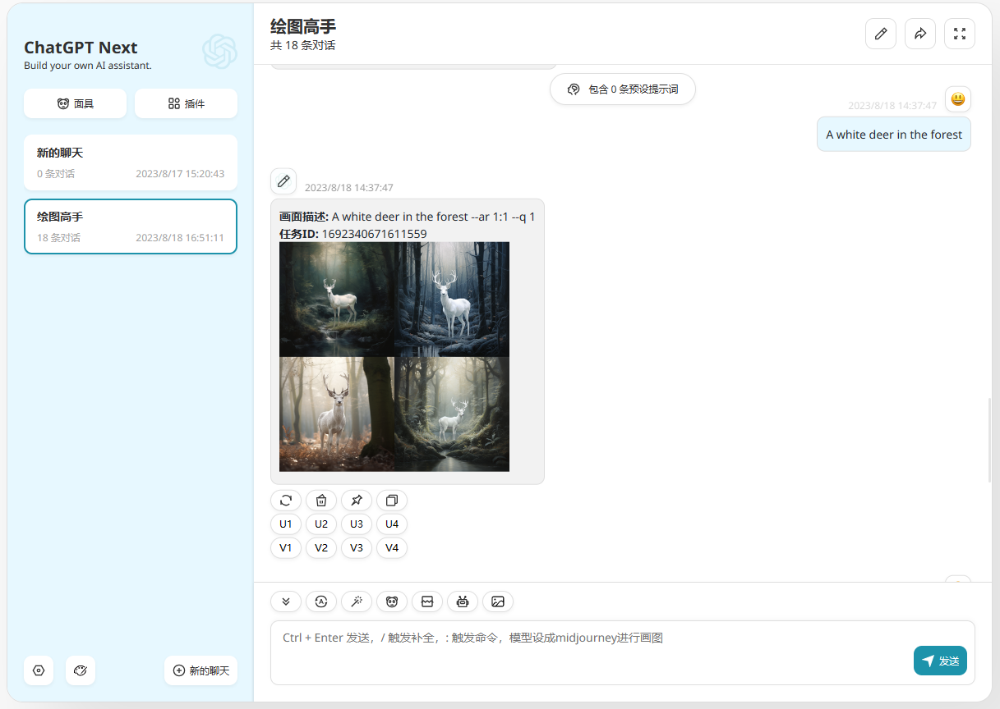
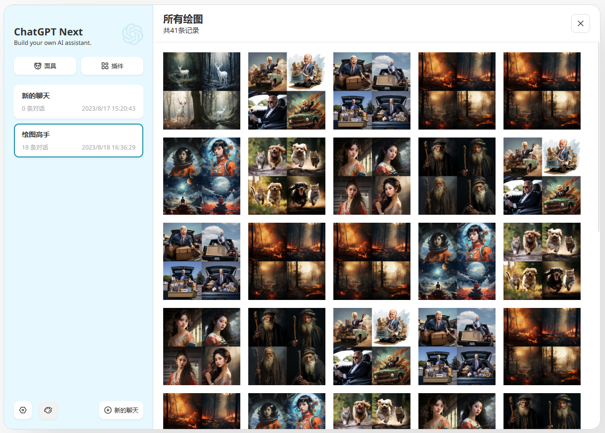
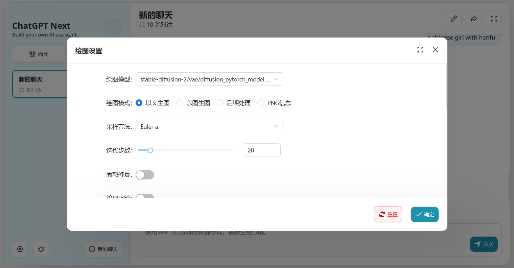
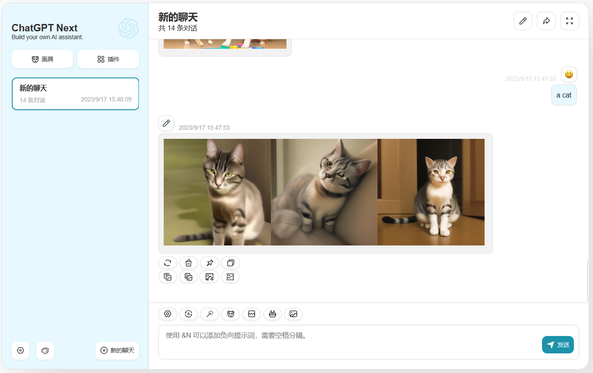
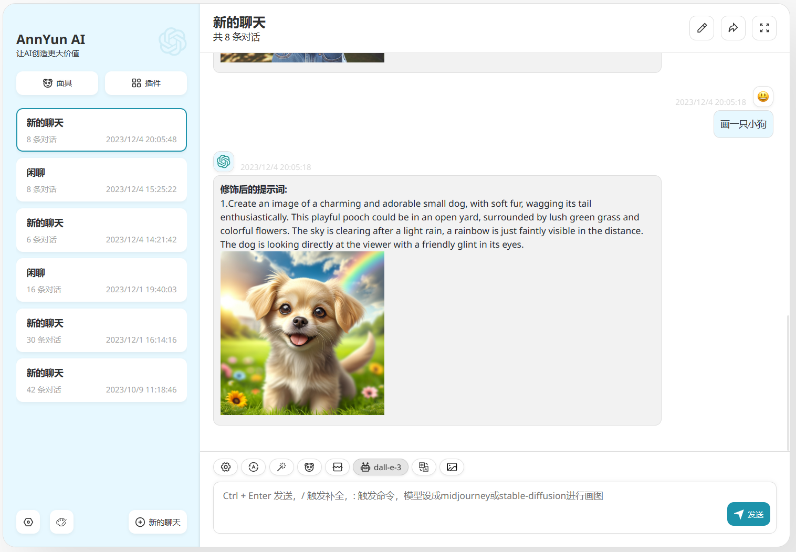
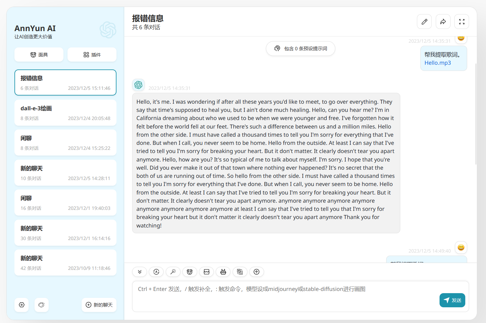
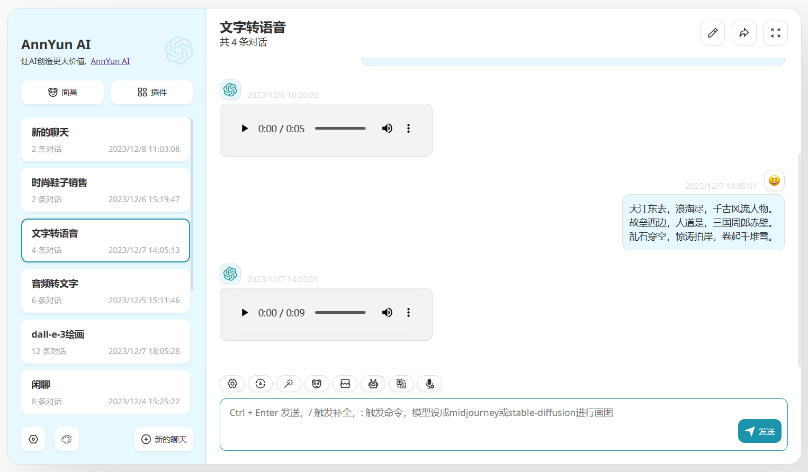
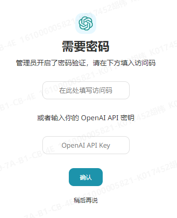

### 版本
#### 无后端：
- 版本号：3.5.9，更新日期：2023.12.13

### 特性（无后端版本）：
- 1.完整的[ChatGPT-Next-Web](https://github.com/ChatGPTNextWebTeam/ChatGPT-Next-Web)功能，并保持同步更新。最近同步时间：2023.12.12
- 2.**增加对接midjourney绘图功能**，该功能基于[ChatGPT-Midjourney](https://github.com/Licoy/ChatGPT-Midjourney)，使用antd进行了完全的重构，界面更加合理，参数更加全面。
- 3.**支持图片上传至阿里云oss或Minio（私有化oss）**，方便图片永久存储，且预览加载更快。
- 4.增加了所有绘画记录页面。
- 5.**接入了stable-diffussion**，文生图、图生图、后期处理、图片信息，近乎完整的参数设置，以及图片完成后的菜单按钮。
- 6.stable-diffusion加入了lora模型。
- 7.**增加翻译功能**，自动识别输入的内容是中文还是英文（如果大部分是中文，则翻译成英文，反之亦然）。
- 8.**设置里增加自定义mj代理密钥**，**且兼容oneapi的mj代理**，并增加环境变量 HIDE_MIDJOURNEY_SETTING，如果设成1，则隐藏mj设置。
- 9.设置里增加展示聊天记录占用存储情况，浏览器localstorage只有5m，存储快满时，建议导出数据备份，然后删除浏览器存的对话。
- 10.增加支持 ***gpt4-vision-preview*** 识图功能，可以上传多张图片。建议配合OSS使用，不然受限于浏览器localstorage只有5m，本地聊天记录不保存图片信息，配置了则会保存图片链接。由于国外无法访问国内oss，只会把图片base64发送出去，建议开通美国阿里云oss。
- 11.增加支持 ***dall-e-3*** 功能，兼容dall-e-2。该功能强烈建议配置oss，详细配置请看参数说明及准备说明。因为openai返回的图片url有效期很短，过期了无法访问，如果返回base64，浏览器存不下。
- 12.增加支持 ***whisper-1*** 音视频转文字功能。该功能也强烈建议配置oss，不然聊天记录不保存文件，影响点击重试。
- 13.增加支持 ***tts*** 文字转语音功能，语音可以直接播放。该功能必须配置oss，不然返回的文件没地方存，如果你的应用地址是https，则oss也必须是https，不然会出现无法播放的问题。
- 14.增加**设置里可以自定义stable-diffusion接口地址**，设置了则用户端请求的时候会使用用户端填的sd地址，如果不想用户设置自定义sd接口地址，则增加环境变量 HIDE_SD_SETTING=1
- 15.增加**自定义网站标题**功能，通过启动参数APP_TITLE=指定，需要获得永久授权后生效。
- 16.增加**自定义网站副标题**，通过启动参数APP_SUB_TITLE=指定，须获得永久授权后生效。
- 17.增加支持 ***gpt-4-all*** 逆向模型（需要你的接口支持），支持上传所有类型文件进行分析，必须配置oss，不然没地方保存文件，至于使用国内oss还是国外oss，具体看你模型后端能力能访问到哪个oss。
- 18.增加支持**链接传入自定义模型，并可支持替换当前模型**，新增链接参数customModels，多个模型用英文逗号","分开，新增replaceCurrentModel，传true或false，当为true时，替换取第一个模型替换掉当前聊天模型。例如：从其它应跳转到当前应用，链接为：http://localhost:3000/#/chat?settins={"key":"xxx","url":"xxx","customModels":"xxx,xxx","replaceCurrentModel":true}

### 特性（有后端版本）：
- 1.包含无后端版本的完整功能。
- 2.正在接入后端管理，目前已实现公众号扫码登录，待其它功能实现后发布。

### 后续待实现
- 【完成】1.接入stable diffussion绘画。
- 【doing】2.接入后端管理，增加账号登录功能。
- 【     】3.权限管理，角色分配，绘画权限，知识库权限，聊天记录保存、查阅等。
- 【     】4.微信扫码、企微免登。
- 【     】5.接入主流知识库，如fastGPT、Dify等。
- 【     】6.联网搜索。
- 【     】7.function call。
- 【完成】8.接入DALL-E。
- 【     】9.待思考。。。

### 示例图片












### 增加的参数
#### 兼容原版[ChatGPT-Next-Web](https://github.com/ChatGPTNextWebTeam/ChatGPT-Next-Web)所有参数，这边只列了新增参数
| 参数名称                        | 必填 | 说明                                                                                                                                                                                                                                                    |
|-----------------------------|----|-------------------------------------------------------------------------------------------------------------------------------------------------------------------------------------------------------------------------------------------------------|
| MIDJOURNEY_PROXY_URL        | 否  | Midjourney代理地址，详细请看[midjourney-proxy](https://github.com/novicezk/midjourney-proxy)                                                                                                                                                                   |
| MIDJOURNEY_PROXY_API_SECRET | 否  | Midjourney代理地址接口密钥，详细请看[midjourney-proxy](https://github.com/novicezk/midjourney-proxy)                                                                                                                                                               |
| HIDE_MIDJOURNEY_SETTING     | 否  | 如果需要隐藏Midjourney设置，则把值设成 1                                                                                                                                                                                                                            |
| DISCORDCDN_PROXY_URL        | 否  | Discordcdn图片地址代理，不填的话，如果访问不了discordcdn，就获取不到图片                                                                                                                                                                                                        |
| STABLE_DIFFUSION_BASE_URL   | 否  | Stable-diffusion的接口地址，需要启动[stable-diffusion-webui](https://github.com/AUTOMATIC1111/stable-diffusion-webui)，[开启api](https://github.com/AUTOMATIC1111/stable-diffusion-webui/wiki/API)。如果要用该功能，必须要配置后面的OSS相关参数，因为stable-diffusion返回的是图片base64，需要有地方存图片 |
| STABLE_DIFFUSION_TIMEOUT    | 否  | Stable-diffusion的接口超时时间，默认10分钟                                                                                                                                                                                                                        |
| HIDE_SD_SETTING             | 否  | 是否隐藏Stable-diffusion自定义接口设置，默认不隐藏，如需隐藏，则设成 1。                                                                                                                                                                                                         |
| OSS_TYPE                    | 否  | OSS 类型，取值( aliyun 或 minio )。填了代表需要上传到oss，且下面的相关参数都得填，具体看下面的参数说明                                                                                                                                                                                       |
| OSS_ENDPOINT                | 否  | 服务器地址，如：aliyun：oss-accelerate.aliyuncs.com，minio：192.168.2.120(这边只填ip，不需要http前缀，端口填在下面那个参数)                                                                                                                                                           |
| OSS_PORT                    | 否  | type为minio，且endpoint为ip时，则需要有端口，minio有两个端口，一个管理端口，一个api端口，这里要填api端口。                                                                                                                                                                                  |
| OSS_HTTPS                   | 否  | type为minio，根据实际情况开启，如果endpoint是ip，那一般填false。如果网站https，那minio也得要通过https访问，不然可能会出现无法预览图片的问题，[可以参考](https://blog.csdn.net/weixin_40461281/article/details/124260888)。                                                                                    |
| OSS_ACCESS_KEY              | 否  | aliyun则填accessKeyId，minio则填username                                                                                                                                                                                                                   |
| OSS_SECRET_KEY              | 否  | aliyun则填accessKeySecret，minio则填password                                                                                                                                                                                                               |
| OSS_BUCKET                  | 否  | 桶名称（minio的桶权限需要设成public，阿里云的桶可以不用设成public，但上传的文件会设成public）                                                                                                                                                                                            |
| OSS_DOMAIN                  | 否  | aliyun oss 绑定的域名,只填域名，不要加http://。 2019.9.23后创建的bucket，需要绑定域名，不然无法预览，[绑定方法参考](https://help.aliyun.com/zh/oss/user-guide/map-custom-domain-names-5)                                                                                                                                                                        |
| AUTHORIZE_CODE              | 是  | 授权码，获取方式，请看后面                                                                                                                                                                                                                                         |
| APP_TITLE                   | 否  | 自定义网站标题，需要获得永久授权后才会生效                                                                                                                                                                                                                                 |

### 需要准备什么
如果你没有直通的网络环境，则需要准备以下事项
- 1.一个域名，因为代理discord，openai，以及aliyun-oss，都需要域名
- 2.部署discord代理，项目地址[discord-proxy](https://github.com/vual/discord-proxy)，fork到自己仓库，然后使用vercel进行部署，绑定自己的域名。
- 3.部署[midjourney-proxy](https://github.com/novicezk/midjourney-proxy)，详细请到对应项目查看。
- 4.部署[openai代理](https://github.com/vual/vercel-proxy-openai)，fork到自己仓库，然后使用vercel进行部署，绑定自己的域名。
- 5.获取阿里云oss的endpoint，key等，[详细参考](https://zhuanlan.zhihu.com/p/445967642) ，bucket可以不用设为公共读，但上传的图片会自动设成公共读。2019.9.23后创建的bucket，需要绑定自己的域名，才能预览，[绑定方法参考](https://help.aliyun.com/zh/oss/user-guide/map-custom-domain-names-5) 。[跨域问题](https://help.aliyun.com/zh/oss/the-no-access-control-allow-origin-error-message-is-still-reported-when-you-call-oss-after-setting-cross-domain-rules)
- 6.部署minio私有化oss，bucket必须要设成public，[docker启动参考官方文档](https://www.minio.org.cn/docs/minio/container/operations/install-deploy-manage/deploy-minio-single-node-single-drive.html)。
- 7.使用stable-diffusion功能需要启动[stable-diffusion-webui](https://github.com/AUTOMATIC1111/stable-diffusion-webui)，详细启动方式请到对应项目查看：https://github.com/AUTOMATIC1111/stable-diffusion-webui/wiki/API

### 启动
##### 1.拉取镜像
```shell
docker pull registry.cn-hangzhou.aliyuncs.com/ann-chat/chatgpt-next-web-pro:3.5.9
```
##### 2.启动应用
```shell
docker run -d -p 3000:3000 \
  -e OPENAI_API_KEY="sk-xxxxxx" \
  -e AUTHORIZE_CODE="授权码" \
  registry.cn-hangzhou.aliyuncs.com/ann-chat/chatgpt-next-web-pro:3.5.9
```
如果你有chatgpt中转地址，则加上 -e BASE_URL="https://xxxxxx" \  ，没加这个参数，默认请求到 https://api.openai.com，
其它参数也是通过增加 -e 然后跟上参数名称和参数值， \ 是换行拼接。

### 授权码价格
#### 授权绑定完整的二级域名，绑定后，只能通过绑定的域名或IP访问！！！也不能更改绑定的域名或IP！！！
#### 无后端版本（后续更新也不会接入后端相关功能）：
- 绑定1个域名或IP，限时特惠：￥129
- 绑定2个域名或IP，限时特惠：￥239
- 绑定3个域名或IP，限时特惠：￥329

（付费即永久授权，可以先试用，试用不收费）

### 授权码获取方式
微信：822784588


### 常见问题
1.通过ngnix转发，页面停留在【需要密码】的页面进不去，


需要在ngnix配置里增加：
```shell
proxy_set_header X-Real-IP $remote_addr;
proxy_set_header X-Forwarded-For $proxy_add_x_forwarded_for;
proxy_set_header X-Forwarded-Proto http;
proxy_set_header Upgrade $http_upgrade;
proxy_set_header Connection "upgrade";
proxy_set_header Host $http_host;
```

2.配置了minio，出现图片无法预览。这个是因为网站是https，所以访问minio也要https，建议用ngnix转发域名方式，[可以参考](https://blog.csdn.net/weixin_40461281/article/details/124260888)

3.如果配置了aliyun oss，出现图片无法预览、或文件上传不了、或语音长度为0的问题，建议检查access_key权限（不是bucket权限），[可以参考添加权限](https://zhuanlan.zhihu.com/p/445967642)

4.配置了aliyun oss，出现图片无法预览，点击链接变成下载，那就是需要绑定自己的域名，然后启动参数增加 OSS_DOMAIN="绑定的域名"，[绑定方法参考](https://help.aliyun.com/zh/oss/user-guide/map-custom-domain-names-5)


