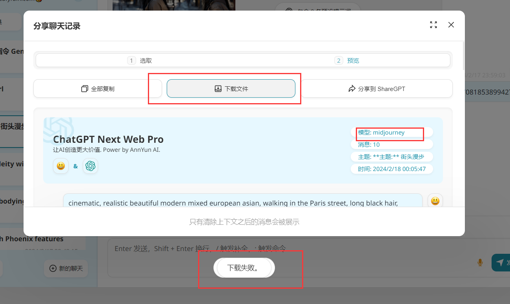

### 声明
    本项目代码没开源，但安全性跟原版ChatGPT-Next-Web完全一致。
    人格保证，所有版本没有任何恶意代码，不会偷key或者泄露key！！！
    如果担心，可自行在部署应用的服务器上安装抓包工具，分析每个对外的请求。

### 版本
#### 无后台：
- 更新日期：2024.05.24
- 版本号：
  - 3.7.20，完整功能，需要授权码
  - 3.7.20-arm，arm64版，完整功能，需要授权码
  - 3.7.20-ce，社区版(免费版)，不需要授权码，功能有限制，详细看后面说明
- 演示地址：
  - 参考有后台版本的用户端，界面和功能大体一样，没有登录、套餐列表、用户中心，没有管理端。

#### 有后台版本：
- 更新日期：2024.05.17
- 版本号：
  - latest
- 演示地址：
  - 用户端地址：https://ai.annyun.cn/ ，支持关注公众号扫码授权登录，也支持邮箱注册，手机号也可以，但本项目没有配置。
  - 管理端地址：https://admin.annyun.cn/ , 账号：annyun，密码：123456


### 特性（无后台版本）：
- **一**. 完整的[ChatGPT-Next-Web](https://github.com/ChatGPTNextWeb/ChatGPT-Next-Web)功能，并保持同步更新。最近同步时间：2024.05.09
- **二**. **文件上传和存储**，接入OSS，也支持自定义文件上传接口，配置详见参数说明，**强烈建议配置该功能，可以让下面很多功能更好用**，以下任选一种即可：
  - 1.**阿里云OSS**，国外那些服务有可能访问不了国内的OSS，建议国内和国际版都测试下。
  - 2.**腾讯云COS**，同上，也是OSS。
  - 3.**MINIO**，私有化部署的OSS，免费的，只是会占用自己的带宽。
  - 4.**自定义文件上传接口**，返回的文件地址需要公网可访问，启动时参数：FILE_UPLOAD_URL=，也支持需要鉴权的上传接口，配合参数：FILE_UPLOAD_KEY=
- **三**. **画图支持**，图片需要有地方存，强烈建议配合OSS或自定义文件上传接口，详见第2点：
  - 1.**Midjourney**，该功能基于[ChatGPT-Midjourney](https://github.com/Licoy/ChatGPT-Midjourney)，使用antd进行了完全的重构，界面更加合理，参数更加全面。
  - 2.**Stable-Diffussion**，**支持lora模型**，**文生图、图生图、后期处理、图片信息**，近乎完整的参数设置，以及图片完成后的功能按钮。
  - 3.**Dall-E-3**，兼容dall-e-2，需要配置文件上传和存储功能，因为openai返回的链接有效期很短，过期就无法访问。
  - 4.增加了**绘画记录**页面，方便查看所有绘图记录。
- **四**. **多模态支持**，强烈建议配置第二点说的文件上传功能：
  - 1.**gpt-4-vision-preview**，发送出去默认是发送原图base64，如果没配置文件存储功能，则会压缩到100k以内再保存到浏览器本地存储。
  - 2.**Dall-E-3**，兼容dall-e-2，需要配置文件上传和存储功能，因为openai返回的链接有效期很短，过期就无法访问。
  - 3.**Whisper和TTS系列模型**，需要配置文件上传和存储功能。
  - 4.**gemini-pro-vision**，可以上传图片，同gpt4v。
  - 5.**claude-3**，可以上传图片。需要通过启动参数CUSTOM_MODELS=，来添加claude模型。目前没有实现直接调用官方接口，需要通过中转接口实现，这边发出的报文跟gpt4v一样格式。非图片文件会把文件链接拼在内容里。
  - 6.**支持提取返回内容里的mp3，mp4链接渲染成播放控件**，可以直接播放, 比如**suno**。
- **五**. **逆向模型支持**
  - 1.**支持gpt-4-all**，官方接口不支持该模型，需要购买支持该模型的中转接口服务。支持上传所有类型文件，需要配合第二点的文件上传功能。
  - 2.**集成GPT商店**，**支持gpt-4-gizmo开头的模型**，部分模型也需要购买支持这些模型的中转接口服务，支持上传所有类型文件。支持隐藏gpt商店，参数HIDE_GPTS=1。
- **六**. **知识库**
  - 1.**接入[fastgpt](https://github.com/labring/FastGPT)知识库**，KNOWLEDGE_BASE_URL=设定fastgpt根地址，配合自定义模型参数CUSTOM_MODELS=，格式：+知识库名称==知识库对应apikey，例如：CUSTOM_MODELS=+知识库1==fastgpt-xxxxxx，apikey不会传到用户端，只会在服务端，可以放心。
- **七**. **其它功能**：
  - 1.**翻译**，自动识别输入的内容是中文还是英文（如果大部分是中文，则翻译成英文，反之亦然）。
  - 2.**设置里增加自定义mj代理密钥**，**Midjourney兼容oneapi的mj代理**，MIDJOURNEY_PROXY_URL填oneapi的接口地址，MIDJOURNEY_PROXY_API_SECRET填oneapi的apikey。
  - 3.**支持直接使用BASE_URL和OPENAI_API_KEY的值当作mj的接口地址和密钥**，需要设置参数REPLACE_MJURL_WITH_BASEURL=1
  - 4.**设置里可以自定义stable-diffusion接口地址**。
  - 5.**设置里增加展示聊天记录占用存储情况**，浏览器localstorage只有5m，存储快满时，建议导出数据备份，然后删除浏览器存的对话。
  - 6.**自定义网站标题、副标题、icon**，参数APP_TITLE=、APP_SUB_TITLE=、APP_ICON=，需要购买授权才生效。
  - 7.**支持通过链接跳转进入应用时，自动填入自定义模型**，新增链接参数customModels，多个模型用英文逗号","分开，新增replaceCurrentModel，传true或false，当为true时，替换取第一个模型替换掉当前聊天模型。例如：从其它应跳转到当前应用，链接为：http://localhost:3000/#/chat?settings={"key":"xxx","url":"xxx","customModels":"xxx,xxx","replaceCurrentModel":true}
  - 8.**支持直接在输入框粘贴文件的方式上传文件**。
  - 9.**朗读文字**功能，设置里可以设置语言和声源。
  - 10.**语音输入**功能，通过录音，发送给openai进行语音转文字，填到输入框里。该功能需要https访问，才能调起浏览器语音权限。启动参数 HIDE_VOICE_INPUT=1，则会隐藏语音输入
  - 11.**支持所有模型上传文件**，非vision或者claude模型，则只会把文件链接拼在内容里发出去，至于能否解析，要看对应模型能力。
  - 12.**增加实时展示用户输入内容的token数量**

### 特性（社区版，无后台）
- 免费使用，直接通过docker拉取镜像启动即可使用，需要把命令里的版本号改成社区版本号，不需要授权码。
- 在无后台版本基础上，限制了一些功能，包括：
  - 1.上传文件只支持minio存储。
  - 2.限制了支持上传文件的模型，vision或者claude模型可以上传图片，Whisper上传语音文件，mj和dall-e-3画图会上传到minio。
  - 2.画图不支持stable-diffusion。
  - 3.不支持逆向模型，如gpt-4-all等，不支持gpts那些模型。
  - 4.不支持知识库。
  - 5.不支持修改网站标题、副标题、icon。

### 特性（有后台版本）：
- **一**. **包含无后台版本的完整功能**。
- **二**. **账号注册与登录**，任选一种即可，支持禁用注册和微信登录：
  - 1.**支持手机号注册登录**。
  - 2.**支持邮箱注册登录**，支持设置邮箱后缀白名单，在annyun-admin的环境变量里增加参数 MAIL_WHITE_LIST。
  - 3.**支持微信公众号扫码关注授权登录**。
- **三**. **AI管理**：
  - 1.**AI平台管理**，
    - 1.1 支持添加不同平台，设置不同的接口地址。
  - 2.**模型管理**，
    - 2.1 支持添加不同平台模型，注意：gpt-4-gizmo-*，别删别改！！！这是gpts应用系列模型，判断套餐内容的时候是用通配符匹配的，也就是所有gpts模型都是判断这个。
    - 2.2 支持设置默认新建会话的默认模型和总结标题的模型。
    - 2.3 支持设置输入输出倍率，默认1，用户输入和模型输出的token和字符数量会乘以这个倍率，作为最终的一个token和字符数量。
  - 3.**ApiKey管理**，
    - 3.1 可以为key单独设置接口地址，如果设置了，则会以这边设置的为准，没设置则以平台管理那边设置的为准。
    - 3.2 可以添加适用的模型，没设置就是该平台下的通用key，如果设置了，用户请求时，会优先使用适用模型的key。
- **四**. **套餐管理**，先设置套餐资源，再设置套餐信息，用户端看到的是套餐信息，一个套餐信息可以包含多个套餐资源，每个套餐资源可以设置不同的模型、不同的计费方式：
  - 1.**套餐资源**：
    - 1.1 套餐内包含的基础资源，可以添加可用模型，设置计费模式、数量限制等。
    - 1.2 数量限制如果设成-1则表示无限制。注意：套餐资源的数量限制，如果设成次数，则只统计用户发送的次数，如果是token或字数，则是双向统计。
  - 2.**套餐信息**：
    - 2.1 可以添加多个套餐资源，设置计费周期、价格、数量倍数，以及限速设置，可以设置多少小时内，只能请求多少次。
    - 2.2 用户购买该套餐后，拥有的数量是：套餐资源的数量限制 * 数量倍数，比如 套餐资源里设置token数量限制是1000，套餐信息这个设置token倍数是10，则用户得到 1000 * 10 = 10000 token。
    - 2.3 如果套餐的计费模式是：用完即止，则用户购买的该套餐，默认有效期是1年。
    - 2.4 可以设置是否作为用户注册就赠送的套餐。如果把一个套餐设成注册赠送，则所有新注册的用户，会自动获得这个套餐，并在登录后自动生效。
  - 3.**套餐兑换码**：
    - 3.1 可以为套餐生成兑换码，当没使用微信支付时，可以让用户通过其它方式把钱付给你，你把兑换码给用户，用户在聊天套餐列表那边进行兑换。
- **五**. **订单管理**：
  - 1.**订单信息**：包含扫码支付和兑换码生成的订单。
- **六**. **会员管理**：
  - 1.**会员信息**：
    - 1.1 支持手动新增会员，并添加套餐，添加的套餐，会在会员登录后自动生效。
    - 1.2 支持批量生成会员账号密码和会员套餐，会自动导出excel，生成的会员套餐，会在会员首次登录后自动生效。
    - 1.3 支持批量给用户授权套餐，授权的套餐会在下一次登录生效。
  - 2.**会员套餐**：
    - 2.1 用户的套餐信息，支持编辑用户套餐，可以修改套餐，生效失效时间，以及重置套餐内容。
    - 2.2 用户购买同一个套餐，有效期是累加的，比如套餐A，有效期一个月，用户已经购买了一个套餐A，过期时间是5月30号，则他在5月30号前再次购买套餐A，则他新套餐的有效期是到6月30号。
    - 2.3 用户购买套餐，是购买了那一刻的套餐镜像，后续对套餐信息或者套餐资源做任何修改，都不会同步给已经购买该套餐的用户，除非通过编辑用户套餐进行重置套餐内容。
- **七**. **会话管理**，会把用户聊天的会话主题和消息保存到后台，用户登录时会拉取最新的聊天记录，也就是用户可以任意浏览器登录，消息都可以同步：
  - 1.**会话主题**：用户聊天的主题。
  - 2.**会话消息**：用户聊天每个主题下的消息记录。
- **八**. **支付**：
  - 1.**微信支付**：需要申请微信商户，开通微信支付。因为需要关联appId，所以还需要申请小程序或者公众号。
  - 2.**易支付**：支持大部分易支付平台，或自建平台。
- **九**. **对接fastgpt知识库**：
  - 1.先在平台管理里建一个平台，平台名称随意，接口地址那边填fastgpt的根地址。
  - 2.然后在模型管理里建模型，模型名称对应fastgpt里建的知识库应用名称。
  - 3.接着在apikey新增fastgpt对应的知识库的apikey，并选择适用模型为第2步建的模型。
  - 4.最后新增套餐资源，并选择前面建的模型，新增套餐信息，选择建好的套餐资源，这样有这套餐的用户就可以与知识库对话了。

### SpringCloud微服务版
本后端项目基于SpringCloud开发，天生就是微服务，但是微服务需要消耗更多的服务器资源，部署和配置也更加复杂，如有需要，可以联系咨询。
  

### 后续待实现
- 【     】1.接入mj-plus。
- 【     】2.联网搜索。
- 【     】3.function call。
- 【     】4.待思考。。。

### 无后台版本示例图片
<div style="display: flex;flex-direction: column">
  <div style="display: flex;flex-direction: row;">
    
    
  </div>
  <div style="display: flex;flex-direction: row">
    
    
  </div>
  <div style="display: flex;flex-direction: row">
    
    
  </div>
  <div style="display: flex;flex-direction: row">
    
    
  </div>
  <div style="display: flex;flex-direction: row">
    
    
  </div>
  <div style="display: flex;flex-direction: row">
    
    
  </div>
</div>

### 有后台版本示例图片
<div style="display: flex;flex-direction: column">
  <div style="display: flex;flex-direction: row;">
    
    
  </div>
  <div style="display: flex;flex-direction: row">
    
    
  </div>
  <div style="display: flex;flex-direction: row">
    
    
  </div>
  <div style="display: flex;flex-direction: row">
    
    
  </div>
  <div style="display: flex;flex-direction: row">
    
    
  </div>
  <div style="display: flex;flex-direction: row">
    
    
  </div>
<div style="display: flex;flex-direction: row">
    
    
  </div>
<div style="display: flex;flex-direction: row">
    
    
  </div>
</div>


### 参数说明
#### 兼容原版[ChatGPT-Next-Web](https://github.com/ChatGPTNextWeb/ChatGPT-Next-Web)所有参数，
| 参数名称                        | 必填 | 说明                                                                                                                                                             |
|-----------------------------|----|----------------------------------------------------------------------------------------------------------------------------------------------------------------|
| OPENAI_API_KEY              | 是  | openai的api key                                                                                                                                                 |
| BASE_URL                    | 否  | openai的接口代理或中转地址，默认`https://api.openai.com`                                                                                                                    |
| OPENAI_ORG_ID               | 否  | OpenAI organization ID                                                                                                                                         |
| AZURE_URL                   | 否  | azure的接口地址，Example: https://{azure-resource-url}/openai/deployments/{deploy-name}                                                                              |
| AZURE_API_KEY               | 否  | azure的api key                                                                                                                                                  |
| AZURE_API_VERSION           | 否  | Azure Api Version, find it at [Azure Documentation](https://learn.microsoft.com/en-us/azure/ai-services/openai/reference#chat-completions).                    |
| GOOGLE_API_KEY              | 否  | Google Gemini Pro Api Key                                                                                                                                      |
| GOOGLE_URL                  | 否  | Google Gemini Pro Api Url                                                                                                                                      |
| CODE                        | 否  | 应用的访问密码，可以设置多个，用英文逗号分割                                                                                                                                         |
| HIDE_USER_API_KEY           | 否  | 如果不想让用户输入自己的apikey，则设成 1                                                                                                                                       |
| DISABLE_GPT4                | 否  | 如果不想让用户使用GPT-4，则设成 1                                                                                                                                           |
| ENABLE_BALANCE_QUERY        | 否  | 如果想让用户可以查询余额，则设成 1 ，否则设成 0                                                                                                                                     |
| DISABLE_FAST_LINK           | 否  | 如果要禁用url中的解析设置，则设成 1                                                                                                                                           |
| CUSTOM_MODELS               | 否  | 自定义模型设置，"+"号增加模型，"-"号隐藏模型，"="号设置模型展示的别名，"-all"禁用所有应用自带模型，例如：CUSTOM_MODELS="-all,+llama,-gpt-3.5-turbo,+gpt-4=模型别名"。本项目还对该参数进行扩展，支持fastgpt，详细设置请看下面新增参数里该参数的说明。 |
| DEFAULT_MODEL               | 否  | 自定义默认模型                                                                                                                                                        |

### 本项目新增参数
| 参数名称                         | 必填 | 说明                                                                                                                                                                                                                                                    |
|------------------------------|----|-------------------------------------------------------------------------------------------------------------------------------------------------------------------------------------------------------------------------------------------------------|
| AUTHORIZE_CODE               | 是  | 本项目授权码，启动就需要有授权码，不然无法启动，获取方式，请看后面                                                                                                                                                                                                                     |
| MIDJOURNEY_PROXY_URL         | 否  | Midjourney代理地址，详细请看[midjourney-proxy](https://github.com/novicezk/midjourney-proxy)                                                                                                                                                                   |
| MIDJOURNEY_PROXY_API_SECRET  | 否  | Midjourney代理地址接口密钥，详细请看[midjourney-proxy](https://github.com/novicezk/midjourney-proxy)                                                                                                                                                               |
| USE_MJ_IMG_SELF_PROXY        | 否  | 如果不需要自代理mj图片地址，则把该参数设成false                                                                                                                                                                                                                           |
| REPLACE_MJURL_WITH_BASEURL   | 否  | 该参数设成1，则如果用户设置里和启动参数都没设置mj的地址和密钥，则直接把base_url和openai_api_key当作mj代理地址和密钥                                                                                                                                                                               |
| HIDE_MIDJOURNEY_SETTING      | 否  | 如果需要隐藏Midjourney设置，则把值设成 1                                                                                                                                                                                                                            |
| DISCORDCDN_PROXY_URL         | 否  | Discordcdn图片地址代理，不填的话，如果访问不了discordcdn，就获取不到图片                                                                                                                                                                                                        |
| STABLE_DIFFUSION_BASE_URL    | 否  | Stable-diffusion的接口地址，需要启动[stable-diffusion-webui](https://github.com/AUTOMATIC1111/stable-diffusion-webui)，[开启api](https://github.com/AUTOMATIC1111/stable-diffusion-webui/wiki/API)。如果要用该功能，必须要配置后面的OSS相关参数，因为stable-diffusion返回的是图片base64，需要有地方存图片 |
| STABLE_DIFFUSION_TIMEOUT     | 否  | Stable-diffusion的接口超时时间，默认10分钟                                                                                                                                                                                                                        |
| HIDE_SD_SETTING              | 否  | 是否隐藏Stable-diffusion自定义接口设置，默认不隐藏，如需隐藏，则设成 1。                                                                                                                                                                                                         |
| OSS_TYPE                     | 否  | OSS 类型，取值( aliyun 或 tencent 或 minio )。填了代表需要上传到oss，且下面的相关参数都得填，具体看下面的参数说明                                                                                                                                                                             |
| OSS_ENDPOINT                 | 否  | 服务器地址，aliyun例如：oss-accelerate.aliyuncs.com；tencent填Region，例如: ap-guangzhou；minio例如：192.168.2.120(这边只填ip，不需要http前缀，端口填在下面那个参数)                                                                                                                         |
| OSS_PORT                     | 否  | type为minio，且endpoint为ip时，则需要有端口，minio有两个端口，一个管理端口，一个api端口，这里要填api端口。                                                                                                                                                                                  |
| OSS_HTTPS                    | 否  | type为minio，根据实际情况开启，如果endpoint是ip，那一般填false。如果网站https，那minio也得要通过https访问，不然可能会出现无法预览图片的问题，[可以参考](https://blog.csdn.net/weixin_40461281/article/details/124260888)。                                                                                    |
| OSS_ACCESS_KEY               | 否  | aliyun则填accessKeyId，tencent则填SecretId，minio则填username                                                                                                                                                                                                 |
| OSS_SECRET_KEY               | 否  | aliyun则填accessKeySecret，tencent则填SecretKey，minio则填password                                                                                                                                                                                            |
| OSS_BUCKET                   | 否  | 桶名称（minio的桶权限需要设成public或者参照[minio权限](https://blog.csdn.net/zdb1314/article/details/125287537)进行配置，阿里云和腾讯云的桶可以不用设成public，但上传的文件会设成public）                                                                                                              |
| OSS_DOMAIN                   | 否  | aliyun oss 绑定的域名,只填域名，不要加http://。 2019.9.23后创建的bucket，需要绑定域名，不然无法预览，[绑定方法参考](https://help.aliyun.com/zh/oss/user-guide/map-custom-domain-names-5)                                                                                                     |
| APP_TITLE                    | 否  | 自定义网站标题，需要获得授权后才会生效                                                                                                                                                                                                                                   |
| APP_SUB_TITLE                | 否  | 自定义网站副标题，需要获得授权后才会生效                                                                                                                                                                                                                                  |
| APP_ICON                     | 否  | 自定义网站浏览器标题icon，填icon图标链接，需要获得授权后才会生效                                                                                                                                                                                                                  |
| KNOWLEDGE_BASE_URL           | 否  | fastgpt的接口根地址，比如：https://ai.fastgpt.in/api ，需配合自定义模型参 CUSTOM_MODELS                                                                                                                                                                                   |
| CUSTOM_MODELS                | 否  | 自定义模型参数，基于原版参数拓展，兼容原版功能。通过自定义模型名称对应fastgpt里的应用，及对应key，格式：+知识库名称==知识库对应apikey，例如：CUSTOM_MODELS=+知识库1==fastgpt-xxxxxx，只会把知识库名称传到前端，apikey不会传到用户端，只会在服务端，可以放心。                                                                                           |
| INPUT_PLACEHOLDER            | 否  | 自定义输入框提示。                                                                                                                                                                                                                                             |
| HIDE_VOICE_INPUT             | 否  | 如果需要屏蔽语音输入，则把该参数设成1。                                                                                                                                                                                                                                  |
| HIDE_GPTS                    | 否  | 如果需要隐藏GPTS，则把该参数设成1。                                                                                                                                                                                                                                  |
| FILE_UPLOAD_URL              | 否  | 自定义文件上传地址（包括上传按钮和输入框粘贴文件上传，以及画图模型返回的图片），上传时的表单参数名：file，返回的数据格式不限，但需要有文件地址，文件地址需要公网可以访问。填了这个参数，所有文件会优先上传到这个接口，没填则上传配置的OSS。                                                                                                                             |
| FILE_UPLOAD_KEY              | 否  | 自定义文件上传接口的鉴权key，填了会在headers里增加 Authorization: "Bearer " + key，为了key的安全，填了key后，默认走服务端上传，要浏览器直接上传，则需要设置下面那个参数                                                                                                                                           |
| FILE_UPLOAD_FROM_BROWSER     | 否  | 自定义文件上传接口填了key后，如果需要在浏览器直接把文件上传到该接口，则需要把这参数值设成：1。设置后，会把鉴权key暴露在浏览器端，有风险，但在文件服务器跟应用不是同一个服务器时，可以节省服务器带宽资源。                                                                                                                                              |
| ALWAYS_DISPLAY_MODEL         | 否  | 如果需要在模型选择那边常显模型名称，则把该参数设成1。                                                                                                                                                                                                                           |
| SEND_IMG_URL                 | 否  | vision或claude模型，发送图片时，默认发送base64，如果需要发送url，则把该参数设成1，前提是配置了文件存储功能，且模型那边能识别url并通过url得到图片。发送url可以节省服务器带宽。                                                                                                                                                |
| DEFAULT_SUMMARIZE_MODEL      | 否  | 总结标题的默认模型，设置后，无论使用哪个模型聊天，都会使用该参数指定的模型进行总结。                                                                                                                                                                                                            |
| HIDE_USER_API_URL            | 否  | 如果需要隐藏用户自定义接口地址，则把该参数设置为1。                                                                                                                                                                                                                            |
| USE_CUSTOM_CONFIG            | 否  | 如果需默认启用用户自定义接口地址，则把该参数设置为1。                                                                                                                                                                                                                           |
| CHAT_GEMINI_THROUGH_OPENAI   | 否  | 如果需让gemini模型走openai接口地址，则把该参数设置为1，前提是接口接收的报文格式要跟openai的一样。                                                                                                                                                                                            |
| CHAT_CLAUDE_THROUGH_OPENAI   | 否  | 如果需让claude模型走openai接口地址，则把该参数设置为1，前提是接口接收的报文格式要跟openai的一样。                                                                                                                                                                                            |
| ENABLE_INJECT_SYSTEM_PROMPTS | 否  | 如果需要关闭注入系统及提示信息，则把该参数设成0，默认是开启的。                                                                                                                                                                                                                      |

### 需要准备什么
- 1.若干个二级域名，本应用需要一个，另外代理discord，openai，aliyun-oss等，都需要域名
- 2.部署[openai代理](https://github.com/vual/vercel-proxy-openai)，fork到自己仓库，然后使用vercel进行部署，绑定自己的域名。如果能直通chatgpt，则不需要配置。
- 3.部署discord代理，项目地址[discord-proxy](https://github.com/vual/discord-proxy)，fork到自己仓库，然后使用vercel进行部署，绑定自己的域名。如果能直通discord，则不需要。
- 4.部署[midjourney-proxy](https://github.com/novicezk/midjourney-proxy)，详细请到对应项目查看。、
- 5.如果你不想配置上面的那些代理，可以考虑买中转接口。
- 6.获取阿里云oss的endpoint，key等，[详细参考](https://zhuanlan.zhihu.com/p/445967642) ，bucket可以不用设为公共读，但上传的图片会自动设成公共读。2019.9.23后创建的bucket，需要绑定自己的域名，才能预览，[绑定方法参考](https://help.aliyun.com/zh/oss/user-guide/map-custom-domain-names-5) 。[跨域问题](https://help.aliyun.com/zh/oss/the-no-access-control-allow-origin-error-message-is-still-reported-when-you-call-oss-after-setting-cross-domain-rules)
- 7.部署minio私有化oss，bucket必须要设成public，[docker启动参考官方文档](https://www.minio.org.cn/docs/minio/container/operations/install-deploy-manage/deploy-minio-single-node-single-drive.html)。
- 8.使用stable-diffusion功能需要启动[stable-diffusion-webui](https://github.com/AUTOMATIC1111/stable-diffusion-webui)，详细启动方式请到对应项目查看：https://github.com/AUTOMATIC1111/stable-diffusion-webui/wiki/API
- 9.腾讯云oss跨域问题，[可以参考](https://cloud.tencent.com/document/product/436/13318)

### 无后台版本部署和启动
##### 1.拉取镜像
```shell
docker pull registry.cn-hangzhou.aliyuncs.com/ann-chat/chatgpt-next-web-pro:3.7.20
```
##### 2.启动应用
```shell
docker run -d -p 3000:3000 \
  -e OPENAI_API_KEY="sk-xxxxxx" \
  -e AUTHORIZE_CODE="授权码" \
  registry.cn-hangzhou.aliyuncs.com/ann-chat/chatgpt-next-web-pro:3.7.20
```
- 3000:3000是端口映射，前面的可以自定义，后面的是容器内部端口，不可更改。比如可以改成：3030:3000, 3080:3000
- 如果你有chatgpt中转地址，则加上 -e BASE_URL="https://xxxxxx" \  ，没加这个参数，默认请求到 https://api.openai.com
- 其它参数也是通过增加 -e 然后跟上参数名称和参数值， \ 是换行拼接。

### 有后台版本部署和启动
##### 1.下载docker-compose.yml文件，文件在本项目 /docker/with-backend/目录下
```shell
wget https://github.com/vual/ChatGPT-Next-Web-Pro/tree/main/docker/with-backend/docker-compose.yml
```
##### 2.编辑docker-compose.yml文件，根据需要，修改里面的环境变量

##### 3.拉取最新镜像，并启动，如果遇到无法执行 docker-compose 命令，则需要先安装 docker-compose
```shell
docker compose pull
docker compose up -d
```
首次启动建议不加 -d ，看看是否有报错，没报错后，结束运行，并加上 -d 重新启动
##### 详细部署说明请看[后台版本部署步骤](./docs/后台版本部署步骤.md)
##### nginx配置参考[nginx参考配置](./docs/nginx.conf)

### 重要！！！后台管理默认账号密码 admin/123456，进入之后记得马上改密码！


### 授权码价格
#### 授权绑定你自己的二级域名，绑定后，只能通过绑定的域名访问！！！也不能更改绑定的域名！！！也可以绑定公网IP，但不建议。试用可以绑定内网IP。
#### 无后台版本（后续更新也不会接入后台相关功能）：
- 绑定1个域名或IP，限时特惠：￥189
- 绑定2个域名或IP，限时特惠：￥339
- 绑定3个域名或IP，限时特惠：￥469

#### 有后台版本价格
- 一个授权码，绑定用户端和管理端域名，限时特惠：￥599

（授权不包含源码。可以先试用，试用不收费。）

### 授权码获取方式
微信：822784588


交流群：


### 常见问题
1.通过ngnix转发，页面停留在【需要密码】的页面进不去，


需要在ngnix的server或者location下增加配置，如果是宝塔，记得关闭ng缓存：
```shell
proxy_set_header X-Real-IP $remote_addr;
proxy_set_header X-Forwarded-For $proxy_add_x_forwarded_for;
proxy_set_header X-Forwarded-Proto http;
proxy_set_header Upgrade $http_upgrade;
proxy_set_header Connection 'upgrade';
proxy_set_header Host $host;
```

2.配置了minio，出现图片无法预览。这个是因为网站是https，所以访问minio也要https，建议用ngnix转发域名方式，[可以参考](https://blog.csdn.net/weixin_40461281/article/details/124260888)

3.如果配置了aliyun oss，出现图片无法预览、或文件上传不了、或语音长度为0的问题，建议检查access_key权限（不是bucket权限），[可以参考添加权限](https://zhuanlan.zhihu.com/p/445967642)

4.配置了aliyun oss，出现图片无法预览，点击链接变成下载，那就是需要绑定自己的域名，然后启动参数增加 OSS_DOMAIN="绑定的域名"，[绑定方法参考](https://help.aliyun.com/zh/oss/user-guide/map-custom-domain-names-5)

5.腾讯云oss跨域问题，[可以参考](https://cloud.tencent.com/document/product/436/13318)

6.如果出现画图的聊天记录导出图片时，无法下载，则要排查下，图片地址是否是https，如果不是，则需要开启https，具体开启方式要看对应的oss，或画图接口那边，地址域名要有ssl证书。



#### 有后台版本常见问题：
1.用户套餐相关问题：
- 用户购买的套餐，是在购买那一刻的套餐镜像，套餐包含哪些内容就只有哪些内容，后续修改了套餐资源或者套餐信息，不会自动同步给已经购买该套餐的用户，可以在会员套餐那边点编辑，勾选重置套餐内容。
- 如果在用户购买套餐后，在ai管理里进行删除或修改模型、平台，可能会对已购买套餐的用户产生影响，可以在会员套餐那边点编辑，勾选重置套餐内容，帮用户同步最新的套餐信息。
- 已用token累加很快，那是因为聊天携带了历史记录，会重复计算。

2.阿里云短信发送提示“该账号找不到对应签名”。
- 短信签名必须是英文字母，不能是汉字。


